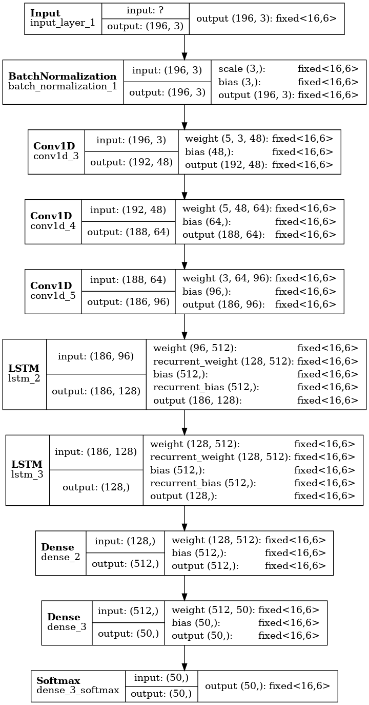

# google quickdraw dataset
Adapted from https://quickdraw.withgoogle.com/

A deep learning neural network with an attempt on Field Programmable Gate Array (FPGA) integration using [hls4ml](https://github.com/fastmachinelearning/hls4ml)

## ML model
Model takes in individual strokes and attempts to classify the drawings. LSTM layers are used to process these sequential strokes to obtain a more accurate detection from the sketch.

## Model predictions
Not the most optimised model but good enough to try out hls4ml with this

## hls4ml
Able to build and compile a hls project but unable to synthesise in docker container with Vivado hls 2020.1
